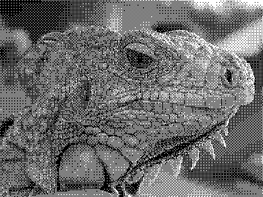

Assignment I

灰階照片轉黑白照片

<ol>
  <li>讀檔</li>
  <li>用CV2取得照片的size</li>
  <li>製作一個4X4的矩陣</li>
  <li>將原圖每個像素從0~255轉成0~15</li>
  <li>將矩陣與照片重疊，像素內容大於矩陣內容便將之改為255；否則改成0</li>
  <li>存檔</li>
</ol>

-----------------------------------------------------------------

多媒體作業I

* Bullet item 1
* Bullet item 2
* Bullet item 3

<ol>
  <li>Numbered item 1</li>
  <li>Numbered item 2</li>
  <li>Numbered item 3</li>
</ol>
 
 

| Title | Column Title 1 | Column Title 2 |
| ------| ------ | ------ |
| Row Title 1 | blah | blah |
| Row Title 2 | blah | blah |
