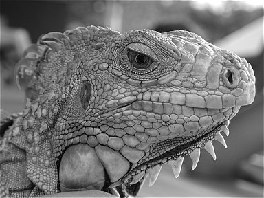

Assignment III

軟體：python
使用套件:PIL, numpy

此次作業主要要藉由演算法，從reference跟target兩張照片預測出中間過程的照片
演算法：sequential search, 2D logarithm search

sequential search：
設置一個search window在要預測的區塊，在用16X16的microblock從reference中找和target中相像的區塊。

 
2D logarithm search:
先在影像中設置一個九宮格，當某一格和要尋找的相似時，再以此格為中心點做一個九宮格，依此類推。

作業將教授給的兩張圖片，透過兩個演算法預測過程影像，其結果應如下：

第一張圖為reference,第三張為target,第三張為預測出來的影像

作業：
1.將圖片傳入sequential search的function，宣告一個存放預測影像的陣列img，利用迴圈將待處理的圖片及參數傳進SNR的function。
SNR會計算出資料的SNR值，算出並回傳最佳座標回sequential。
target會利用回傳的座標找尋該位置的最佳相似影像並存入img，完成預測。
2.2D logarithm search尚未編寫。

遇到問題：
在把影像轉為陣列時可能變成一串陣列，造成後面許多bug；檢查並嘗試修改，但仍無法完整除蟲。

------------------------------------------------------------------------
Assignment II

軟體:python
使用套件:numpy,scipy

1.製作音樂訊號

  利用9個level中的第2和第4個level組合成一段音訊
  
 
 
  (將兩個level各自存放至list)
 
  a1 = [131,147,165,175,196,220,247] (第四)
 
  a2 = [33,37,41,44,49,55,62] (第二)
  
 
 
 2.再將一段音樂(作業使用小星星片段)extend至一個list
 
  
 
  
  
 
 
 3.兩段音樂extend到list時，訊號皆經過frequencies specify
 
  將訊號做轉換
 
  公式:A*sin(2*pi*f*t)
 
   
  
 
 
 4.再將兩個list中的data合併:
 
   music_mix = []
  
  
   for i in range(len(music1)):
  
     music_mix.extend([music1[i],music2[i]])
     
     
     
5.Frequency Modulation:

    將訊號再做一次cos轉換，再將原本的sin(t)和轉換的cos(wt)相乘，調整原始訊號之頻率
    
        
    
    
    
    
    因用a.dot(b)的函數相乘程式無法跑，所以改用numpy中的multiply:
    
    
    m1 = np.multiply(a,b1)
    
    
    m2 = np.multiply(a,b2)
    
    
    m3 = np.multiply(a,b3)

遇到的問題:

  <li>一開始將frequencies specify過的data一起存入一個list，但程式無法run，因此改成進行extend的時候才同時轉換。</li>
 
  <li>兩段音樂單獨播放的時候，旋律聽起來都正常；但合併在一起時感覺訊號受到干擾(音樂聽起來很奇怪)</li>
  
  <li>sin(t)和轉換的cos(wt)相乘後程式錯誤，程式無法執行</li>
  
  <li>換成numpy中的multiply雖然程式成功run了，但音訊沒有聲音</li>

---------------------------------------------------------------

Assignment I

灰階照片轉黑白照片

<ol>
  <li>讀檔</li>
  <li>用CV2取得照片的size</li>
  <li>製作一個4X4的矩陣</li>
  <li>將原圖每個像素從0~255轉成0~15</li>
  <li>將矩陣與照片重疊，像素內容大於矩陣內容便將之改為255；否則改成0</li>
  <li>存檔</li>
</ol>

 

-----------------------------------------------------------------

多媒體作業I

* Bullet item 1
* Bullet item 2
* Bullet item 3

<ol>
  <li>Numbered item 1</li>
  <li>Numbered item 2</li>
  <li>Numbered item 3</li>
</ol>
 
 

| Title | Column Title 1 | Column Title 2 |
| ------| ------ | ------ |
| Row Title 1 | blah | blah |
| Row Title 2 | blah | blah |
